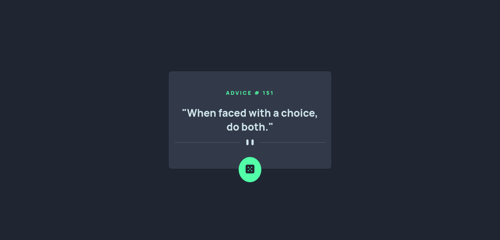

# Frontend Mentor - Advice generator app solution

This is a solution to the [Advice generator app challenge on Frontend Mentor](https://www.frontendmentor.io/challenges/advice-generator-app-QdUG-13db). Frontend Mentor challenges help you improve your coding skills by building realistic projects.

## Table of contents

- [Overview](#overview)
  - [The challenge](#the-challenge)
  - [Screenshot](#screenshot)
  - [Links](#links)
- [My process](#my-process)
  - [Built with](#built-with)
  - [What I learned](#what-i-learned)
- [Author](#author)

**Note: Delete this note and update the table of contents based on what sections you keep.**

## Overview

### The challenge

Users should be able to:
- See random advices.
### Screenshot



### Links

- Solution URL: [Add solution URL here](https://your-solution-url.com)
- Live Site URL: [Add live site URL here](https://your-live-site-url.com)

## My process

### Built with

- Semantic HTML5 markup
- CSS custom properties
- Flexbox
- CSS Grid
- Mobile-first workflow
- JavaScript, asynchronism

### What I learned

while a I was solving this challenge I needed to remenber how to work with asynchronus javascript functions, first of all a try to solver with older version AJAX, but reading javascript documentation I found fetch function. this function is a promise function and always returns a response.

To see how you can add code snippets, see below:

First solution, using AJAX and callback
to resolve challenge.
```js
const ajaxAdvice( url, callback ) => {
  const xhttp = new XMLHttpRequest();
  xhttp.onreadystatechange = function(event) {
    if( this.readyState == 4) {
      if( this.state == 200 ) {
        return callback(null, JSON.parse(this.responseText));
      }
      else {
        return callback('Something wrong', null);
      }
    }
  };
  xhttp.open('GET', url, true);
  xhttp.send();
}
```
Another solution using fetch.
```js
/* producer */
const getData( url ) => {
  return fetch(url)
  .then ( response => response.json());
}

/* Consumer*/
const renderAdvice = async ( url ) => {
  try {
    let data = await getData( url );
    /* code here*/
  }
  catch(error) {
    console.error(error);
  }
}
```
Solution using Promises
```js

/* This function return a promise */
const promiseAdvice = (url) => {
  return new Promise( (resolve, reject) => {
    const xhttp = new XMLHttpRequest();
    xhttp.onreadystatechange = (event) => {
      if(xhttp.readyState == 4) {
        (xhttp.status == 200) 
        ? resolve(JSON.parse(xhttp.responseText))
        : reject(new Error('Something wrong'));
      }
    }
    xhttp.open('GET', url, true);
    xhttp.send();
  })
}
```

If you want more information about fetch and promises, visit [Using the Fetch API](https://developer.mozilla.org/en-US/docs/Web/API/Fetch_API/Using_Fetch) to learn more.

## Author

- Website - [Add your name here](https://www.your-site.com)
- Frontend Mentor - [@yourusername](https://www.frontendmentor.io/profile/yourusername)
- Twitter - [@yourusername](https://www.twitter.com/yourusername)

**Note: Delete this note and add/remove/edit lines above based on what links you'd like to share.**

## Acknowledgments

This is where you can give a hat tip to anyone who helped you out on this project. Perhaps you worked in a team or got some inspiration from someone else's solution. This is the perfect place to give them some credit.

**Note: Delete this note and edit this section's content as necessary. If you completed this challenge by yourself, feel free to delete this section entirely.**
